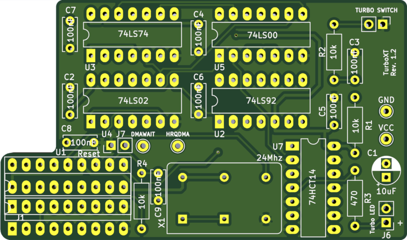
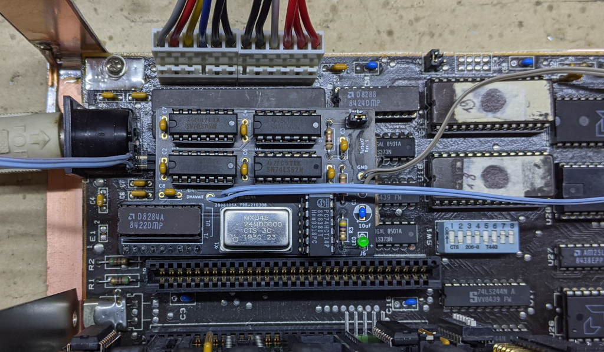

# TurboXT Addon for the IBM XT (5160)

## Introduction

This board is originally based on schematics I found floating around on VCFED, and adds the following to an IBM XT:

- Switchable clock between **standard** (4.77Mhz) and **turbo** (8Mhz if the oscillator installed on the board is 24Mhz)
- Auto disable of turbo-mode during DMA
- Reset button header

### Disclaimer

I take NO responsibility for what happens if you decide to build and use this card. Your computer might crash, catch fire or be destroyed in other nasty ways.
Also, as this card is mostly based on the work of others, You're encourauged to take what you deem fit from this, and use it in your projects!

## Installation

The board is installed on the 8284 socket (near the 8088 processor) via turned pin headers, and the 8284 is placed on a socket on top of the board.
Usually, an additional socket is added to the bottom headers to gain some vertical spacing, as part of the board sits above 8088 and 8087 sockets.

The TurboXT then has 4 additional labeled connections to make on the motherboard via wire.

These connections are required to automatically disable turbo during DMA:

- HRQDMA from pin 10 of the 8237 DMA controller (U28) or pin 5 of U57 (74LS20)
- DMAWAIT from pin 7 of a 74LS175 flipflop (U88)

These are optional but highly recommended to provide an additional source of power beside the 8284 socket:

- VCC: Connect to a +5V spot on the board
- GND: Connect to a GND spot on the board

There are many connection points you can use (VCC/GND legs of another IC for example), but along the side of the XT power connector
there are two empty resistor footprints on my board that were perfect for the connection.

**Check continuity with a multimeter!!!**

# Known issues and caveats 

- The board sits on top of (but should not make contact with) the 8088 and 8087. These can get hot, add a fan or something to keep them cooler.
- Some CMOS variants of the 8284 do not drive the OSC signal when the F/C pin is high. This is required for this board to work. I tested mine with the original Intel 8284.
- The components on top of the board could cause some clearance issues with cards installed in slot 8. Some redesigning is required to address this.

## Bill of Materials

# Credits

Original schematics from [this](www.vcfed.org/forum/showthread.php?70923-IBM-5160-overclock-Sergey%92s-way) thread on VCFED.

